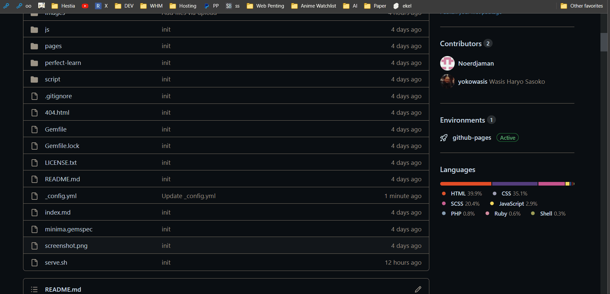
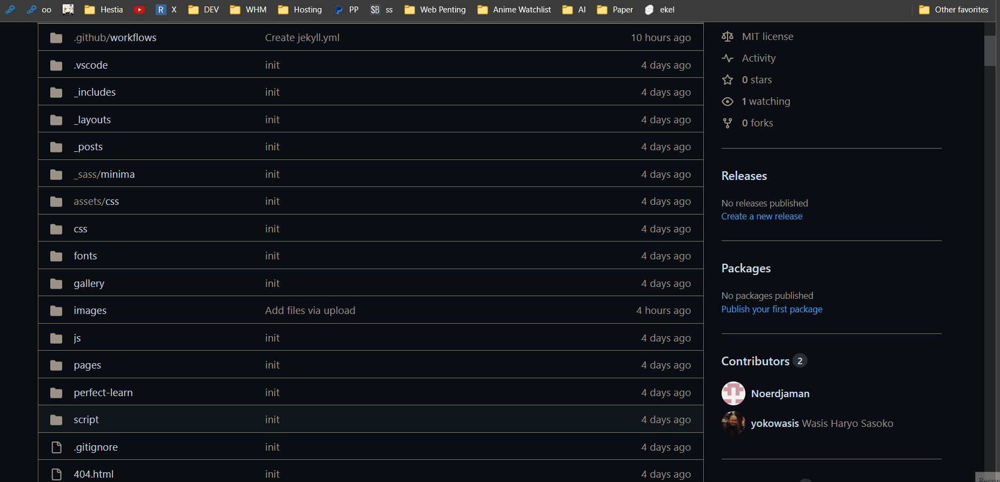

# Tutorial Dasar

## Mengedit File



## Mengupload File



# Mengganti Identitas Sekolah

Untuk mengganti identitas sekolah, edit file `_config.yml`. Ganti bagian - bagian yang di rasa perlu.

# Mengganti Logo

1. Upload logo ke ke folder images. Disarankan menggunakan format file png dan background transparant. Ada 3 macam logo, yaitu logo bagian header, footer dan icon.
2. Edit file `_config.yml`. 

Rubah bagian

```
logo: /images/Capture.PNG
logofooter: /images/footer_logo.png
icon: /images/logo smk.png
```

Sesuai dengan nama file yang di upload. contoh :

```
logo: /images/logoheader.png
logofooter: /images/logofooter.png
icon: /images/logoicon.png
```

# Mengganti Slider
1. Upload file - file slider ke dalam folder `images`. Ukuran gambar yang disarankan adalah `1600 x 900` pixels. 
2. Edit file `_config.yml`. 

Rubah bagian

```
sliders:
  - title: xxx
    text: xxx
    image: xxx
    link: xxx
    linktext: xxx
```

Sesuai dengan nama file yang di upload. contoh :

```
sliders:
  - title: Judul Slider
    text: Deskripsi Slider
    image: /images/namafilderslider.jpg
    link: /berita/2023/07/27/contoh-url-post.html
    linktext: Berita Selengkapnya
```

# Menambah Berita


## Format Nama File
1. Buat file baru pada folder `_posts`

2. Nama file harus memiliki syarat :
- Diawali tanggal post
- Tidak memiliki spasi
- Huruf kecil semua
- Berextensi `md`

Contoh :

`2023-07-27-ini-adalah-contoh-post.md`

Bagian tanggal sebaiknya diisi tanggal kemarin agar berita bisa langsung terbit.

## Format Isi

```
---
layout: post
title: "Contoh Post Baru"
date: 2023-07-26
categories: Berita
img: https://asset.kompas.com/crops/7NiOCG5IO9HArWHndVTRRNLa-Mo=/0x0:917x611/750x500/data/photo/2022/11/18/6377237c17e09.jpg
author: Wasis H.S.
editor: Wasis H.S.
---

Disini di tulis berita yang terbaru
```

File harus di awali dengan metadata yang di awali dan di akhiri dengan `---`. Isi berita di tulis di bawah metadata.

Penulisan isi berita menggunakan `markdown`. [Panduan Markdown](https://www.petanikode.com/markdown-pemula/).

# Menghapus Berita
Untuk menghapus berita, hapus file pada folder `_posts`.

# Menambah Menu dan Halaman

## Menambah Halaman
Untuk membuat halaman baru, buat file baru pada folder `pages` dengan extensi `.md`. Contoh `info-ppdb.md`

### Format Penulisan Halaman

```
---
layout: default
---

# INFO PPDB

Penerimaan Peserta Didik Baru (PPDB) Tahun Ajaran 2023/2024..... dst nya.
```

## Menambah Menu
Untuk menambah menu baru yang melink kepada halaman edit file `_config.yml`.

Rubah bagian :
```
menus:
  - title: Home
    link: /
```

Tambah sesuai halaman yang ditambah pada langkah sebelumnya. Contoh :

```
menus:
  - title: Home
    link: /
  - title: Info PPDB
    link: /info-ppdb
```

untuk bagian link sama dengan nama file hanya saja **tanpa** extensi `.md`.

## Menambah Submenu
Untuk menambah submenu, edit file `_config.yml`.

Rubah bagian menu yang mau di tambah submenu. Contoh sebelum dirubah :

```
menus:
  - title: Home
    link: /
  - title: Info PPDB
    link: /info-ppdb
```

menjadi :L

```
menus:
  - title: Home
    link: /
  - title: Info PPDB
    link: #info-ppdb
    submenus:
    - title: Jadwal PPDB
      link: /pages/jadwal-ppdb
    - title: Pengumuman
      link: /pages/pengumuman-ppdb
```

perhatikan bagian link root menu berubah dan diawali dengan `#` bukan lagi dengan `/`.

# Gallery

Untuk menambah galeri foto, upload foto - foto ke dalam folder `gallery`. Lalu edit file `_config.yml`. Dan rubah bagian :

```
galleries:
  - title: Foto 1
    img: xxx.jpeg
```

sesuai dengan nama file yang di upload. Contoh :
```
galleries:
  - title: Foto Penerimaan PPDB
    img: /gallery/penerimaan-ppdb.jpeg
  - title: Pawai Hari Kemerdekaan
    img: /gallery/pawai.jpeg
```

